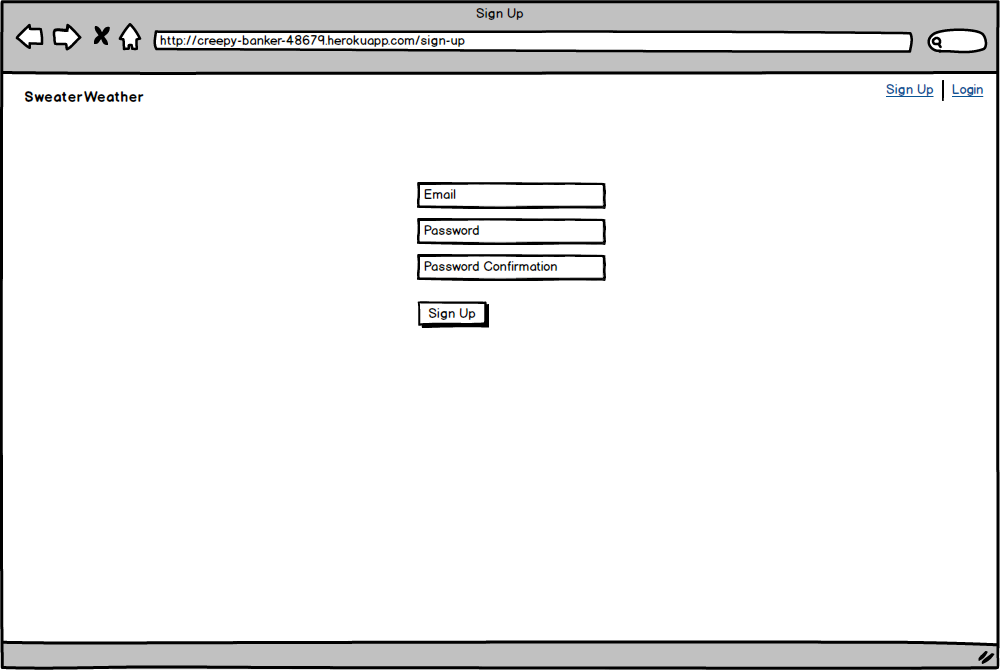
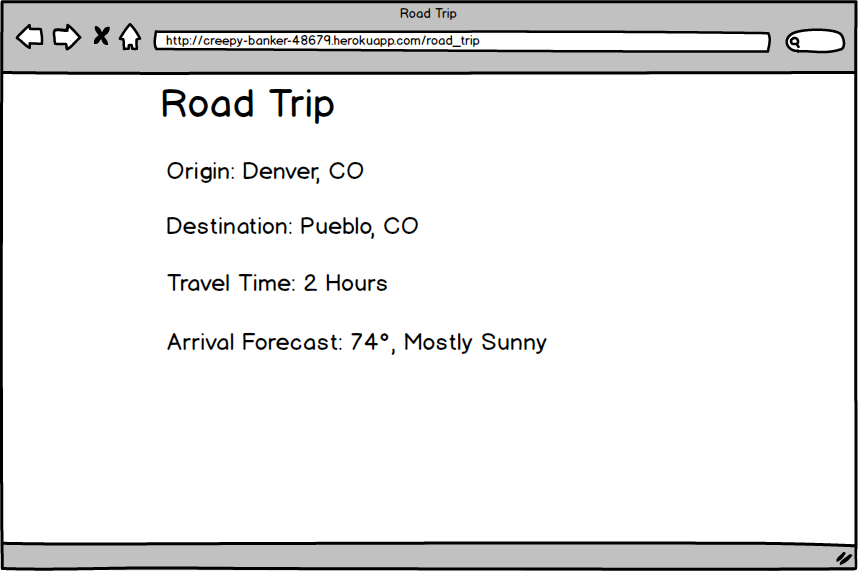

<div align="center">
  <h1>Whether, Sweater? API</h1>

  <p>
    
  </p>
</div>

![Version][version-badge]
[![Ruby Style Guide][rubocop-badge]][rubocop-url]
[![Contributors][contributors-badge]][contributors-url]
[![Forks][forks-badge]][forks-url]
[![Stargazers][stars-badge]][stars-url]
[![Issues][issues-badge]][issues-url]

Whether, Sweater? API is the back-end architecture of Sweater Weather. Sweater Weather is a web application that allows users to plan for a road trip by checking the weather forecast at their destination city.

The Sweater Weather front-end application communicates with this API to perform the following features:

- register a user
- login a user
- get the weather forecast at the destination city
- get a website background image based on the destination city
- get the estimated travel time to the destination city
- get the destination city's weather forecast based on the estimated arrival time
- get book recommendations based on the destination city

This API consumes four third-party APIs and aggregates the data to return the requested information.

## Table of Contents

- [Technologies Used](#technologies-used)
- [Getting Started](#getting-started)
  - [Fork and Clone This Repository](#fork-and-clone-this-repository)
  - [Installation](#installation)
- [API Consumption](#api-consumption)
  - [Third-Party APIs](#third-party-apis)
  - [Making API Endpoint Requests](#making-api-endpoint-requests)
  - [Endpoint Documentation](#endpoint-documentation)
- [Wireframes](#wireframes)
- [Project Background](#project-background)
- [Contributors](#contributors)

## Technologies Used
- Rails 5.2.6
- Ruby 2.7.2
- PostgreSQL 13.3
- Gems: FactoryBot, Faker, Faraday, Figaro, Pry, RSpec, RuboCop, Shoulda-Matchers, SimpleCov, VCR, Webmock
- Processes: OOP, TDD, MVC, REST

## Getting Started

#### Fork and Clone This Repository
Fork this [Repository][Repository]. In your forked repository, copy the `https://` clone URL or SSH URL.  Run the following command in your terminal from your project directory:
```sh
$ git clone insert_copied_url_here
```

#### Installation
Run the following command in your terminal from your project directory:
```sh
$ bundle install
$ rails db:create
$ rails db:migrate
```

## API Consumption

### Third-Party APIs
The following third-party APIs were used that require an API Key. Get your API key for each service:
- [OpenWeather API](https://openweathermap.org/api/one-call-api)
- [MapQuest API](https://developer.mapquest.com/documentation/geocoding-api/)
- [Unsplash API](https://unsplash.com/developers)
- [OpenLibrary API](https://openlibrary.org/developers/api) (No API key required)

After you get your API keys, install the [Figaro gem](https://github.com/laserlemon/figaro#getting-started) from your project directory:

``` sh
$ bundle exec figaro install
```
This creates a commented `config/application.yml` file and adds it to your `.gitignore`.  Populate each ENV variable with your respective API key as follows:

``` rb
# config/application.yml

mapquest_api_key: insert_mapquest_api_key_here
open_weather_api_key: insert_open_weather_api_key_here
unsplash_api_key: insert_unsplash_api_key_here
```

### Making API Endpoint Requests

Make the endpoint requests from your local machine.  Fire up the Rails server by running the following command in your terminal from your project directory:
``` sh
$ rails s
```

The `base path` of each endpoint is as follows:

```
http://localhost:3000
```

### Endpoint Documentation

The following table presents each API endpoint, path, and a link to its documentation.  

Endpoint                                 | Path                      | Docs
-----------------------------------------|---------------------------|------------------------
Retrieve Weather for a City              | `GET /api/v1/forecast`    | [docs][retrieve-weather]
Retrieve a Background Image for a City   | `GET /api/v1/backgrounds` | [docs][retrieve-background-image]
Register a User                          | `POST /api/v1/users`      | [docs][register-user]
Login a User                             | `POST /api/v1/sessions`   | [docs][login-user]
Plan a Road Trip                         | `GET /api/v1/road_trip`   | [docs][plan-road-trip]
Retrieve Books Based on Your Destination | `GET /api/v1/book-search` | [docs][retrieve-books]

## Wireframes

The following wireframes represent what the front end of the application will look like.  This is what the user will see when they visit the website.

<div align="center">
  
  <p>
    <b>Wireframe 1.</b> Root Page Wireframe
  </p>

  
  <p>
    <b>Wireframe 2.</b> User Registration Wireframe
  </p>

  
  <p>
    <b>Wireframe 3.</b> User Login Wireframe
  </p>

  
  <p>
    <b>Wireframe 4.</b> Road Trip Wireframe
  </p>
</div>

## Project Background

This project was developed by Scott Borecki for the final project at Turing School's Back End Engineering Program.  The project was developed from scratch in about 7 days.

The project description and base requirements can be found here: [link][whether-sweater-home]

## Contributors

| ![GitHub Avatar: Scott Borecki][github-avatar] | Scott Borecki<br><br>[![GitHub: Scott-Borecki][github-follow-badge]][GitHub]<br>[![Email: scottborecki@gmail.com][gmail-badge]][gmail]<br>[![LinkedIn: scott-borecki][linkedin-badge]][LinkedIn]<br> |
|-|-|

<!-- Top Level Badges and Links -->
[rubocop-badge]: https://img.shields.io/badge/code_style-rubocop-brightgreen.svg?style=flat-square
[rubocop-url]: https://github.com/rubocop/rubocop
[version-badge]: https://img.shields.io/badge/API_version-V1-or.svg?&style=flat-square&logoColor=white
[contributors-badge]: https://img.shields.io/github/contributors/scott-borecki/whether-sweater-api.svg?style=flat-square
[contributors-url]: https://github.com/scott-borecki/whether-sweater-api/graphs/contributors
[forks-badge]: https://img.shields.io/github/forks/scott-borecki/whether-sweater-api.svg?style=flat-square
[forks-url]: https://github.com/scott-borecki/whether-sweater-api/network/members
[stars-badge]: https://img.shields.io/github/stars/scott-borecki/whether-sweater-api.svg?style=flat-square
[stars-url]: https://github.com/scott-borecki/whether-sweater-api/stargazers
[issues-badge]: https://img.shields.io/github/issues/scott-borecki/whether-sweater-api.svg?style=flat-square
[issues-url]: https://github.com/scott-borecki/whether-sweater-api/issues

<!-- Docs -->
[retrieve-weather]: /docs/endpoints/retrieve_weather.md
[retrieve-background-image]: /docs/endpoints/retrieve_background_image.md
[register-user]: /docs/endpoints/register_user.md
[login-user]: /docs/endpoints/login_user.md
[plan-road-trip]: /docs/endpoints/plan_road_trip.md
[retrieve-books]: /docs/endpoints/retrieve_books.md

<!-- Links -->
[Repository]: https://github.com/Scott-Borecki/whether-sweater-api
[GitHub]: https://github.com/scott-borecki
[gmail]: mailto:scottborecki@gmail.com
[LinkedIn]: https://www.linkedin.com/in/scott-borecki/
[postman-url]: https://www.postman.com/
[whether-sweater-home]: https://backend.turing.edu/module3/projects/sweater_weather/

<!-- Badges -->
[github-follow-badge]: https://img.shields.io/github/followers/scott-borecki?label=follow&style=social
[gmail-badge]: https://img.shields.io/badge/gmail-scottborecki@gmail.com-green?style=flat&logo=gmail&logoColor=white&color=white&labelColor=EA4335
[linkedin-badge]: https://img.shields.io/badge/Scott--Borecki-%23OpenToWork-green?style=flat&logo=Linkedin&logoColor=white&color=success&labelColor=0A66C2

<!-- Images -->
[github-avatar]: https://avatars.githubusercontent.com/u/79381792?s=100
